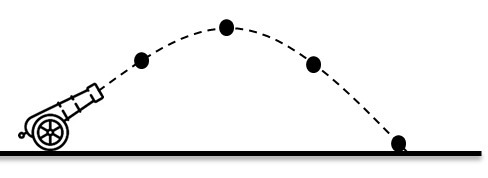

#### 1. Vectores
##### 1.1. Verificar si la suma de vectores de conmutativa con:
$$\vec{x} = (1,4,10), \quad \vec{v}=(1,2,3), \quad \vec{u}=(0,0,0) $$
ID: **06**

#### 2. Movimiento Rectilíneo uniforme
##### 2.1. Vas en un vehículo hacia el sur con una velocidad $v=\frac{km}{h}$, determine que distancia recorre el vehículo en 12 minutos, recordar:
$$x = \vec{v}*t$$
ID: **07**

#### 3. Movimiento Rectilíneo Uniformemente Variado
##### 3.1. Una bala es dispara por un cañon con una velocidad inicial $\vec{v}_0 = 50\hat{i} + 86.6 \hat{j} \left[ \frac{m}{s} \right]$ calcular el tiempo de vuelo de la bala.
  
 
ID: **08**

#### 4. Caida libre
##### 4.1. La siguiente gráfica a que movimiento corresponde:
```{r}
y<-function(t){-9.81/2*(t^2)}
plot(y,from=-3,to=3, lwd=2,col="red", main="Función ?")
```

* Parabólica
* MRU
* Caida Libre

ID: **09**

#### 5. Factores de conversión
##### 5.1. Convertir $10[km]$ a $[m]$:

ID: **10**